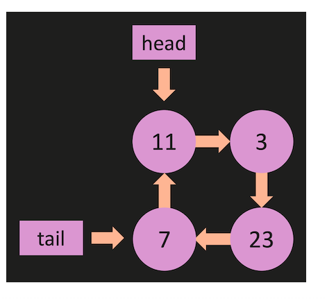

## Leetcode Problems

## Find Middle Node

LL: Find Middle Node ( \*\* Interview Question)
Implement a member function called findMiddleNode() that finds and returns the middle node of the linked list.

Note: this LinkedList implementation does not have a length member variable.

Output:

\*Return the middle node of the linked list.

\*If the list has an even number of nodes, return the second middle node (the one closer to the end).

Constraints:

\*You are not allowed to use any additional data structures (such as arrays) or modify the existing data structure.

\*You can only traverse the linked list once.

Example 1:

Suppose you have a LinkedList object, list, with the following values:
1 -> 2 -> 3 -> 4 -> 5

After calling the findMiddleNode() function:

let middle = list.findMiddleNode();
The middle node should have the value 3.

Example 2:

Now suppose you have a LinkedList object, list, with the following values:
1 -> 2 -> 3 -> 4 -> 5 -> 6

After calling the findMiddleNode() function:

let middle = list.findMiddleNode();
The middle node should have the value 4.

## Has Loop Problem

LL: Has Loop ( \*\* Interview Question)
Write a method called hasLoop that is part of the linked list class.

The method should be able to detect if there is a cycle or loop present in the linked list.

You are required to use Floyd's cycle-finding algorithm (also known as the "tortoise and the hare" algorithm) to detect the loop.

This algorithm uses two pointers: a slow pointer and a fast pointer. The slow pointer moves one step at a time, while the fast pointer moves two steps at a time. If there is a loop in the linked list, the two pointers will eventually meet at some point. If there is no loop, the fast pointer will reach the end of the list.

The method should follow these guidelines:

\*Create two pointers, slow and fast, both initially pointing to the head of the linked list.

\*Traverse the list with the slow pointer moving one step at a time, while the fast pointer moves two steps at a time.

\*If there is a loop in the list, the fast pointer will eventually meet the slow pointer. If this occurs, the method should return true.

\*If the fast pointer reaches the end of the list or encounters a null value, it means there is no loop in the list. In this case, the method should return false.

# Output:

Return true if the linked list has a loop.

Return false if the linked list does not have a loop.

Constraints:

You are not allowed to use any additional data structures (such as arrays) or modify the existing data structure.

You can only traverse the linked list once.

## Remove Duplicate

LL: Remove Duplicates ( \*\* Interview Question)
Implement a member function called removeDuplicates() that removes all duplicate nodes from the linked list based on their values.

Note: this linked list class does NOT have a tail which will make this method easier to implement.

Output:

The function should modify the linked list in-place, removing all nodes with duplicate values.

Constraints:

You are allowed to use the JavaScript Set data structure to keep track of unique node values.

Example 1:

Suppose you have a LinkedList object, list, with the following values:
1 -> 2 -> 3 -> 2 -> 1 -> 4

After calling the removeDuplicates() function:

list.removeDuplicates();
The linked list should now have the following values: 1 -> 2 -> 3 -> 4

Example 2:

Now suppose you have a LinkedList object, list, with the following values:
3 -> 3 -> 3

After calling the removeDuplicates() function:

list.removeDuplicates();
The linked list should now have the following value: 3

Remember to update the length.
